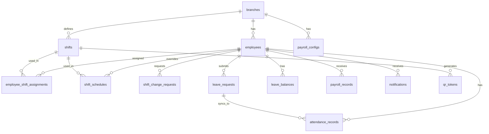

# DATABASE.md – Schema Supabase

> Tất cả bảng đều có `branch_id` để hỗ trợ multi-branch trong tương lai.
> UUID làm primary key toàn bộ. Timestamps dùng `timestamptz`.

---

## Bối cảnh thiết kế

Schema được thiết kế xung quanh 4 nghiệp vụ chính:

1. **Chấm công** — Mỗi ngày, nhân viên quét QR để ghi nhận check-in/out vào `attendance_records`. Hệ thống tự tính trạng thái dựa trên `shifts`.
2. **Nghỉ phép** — Nhân viên tạo `leave_requests`, admin duyệt. Khi duyệt, tự động tạo `attendance_records` tương ứng và trừ `leave_balances`.
3. **Đổi ca** — Nhân viên tạo `shift_change_requests`. Khi duyệt, ghi vào `shift_schedules` (override ca ngày đó). Hệ thống ưu tiên `shift_schedules` hơn `employee_shift_assignments`.
4. **Tính lương** — Cuối tháng, Edge Function đọc `attendance_records` + `payroll_configs` + `employees` để tính và lưu vào `payroll_records`.

---

## Luồng dữ liệu theo nghiệp vụ

### Khi nhân viên check-in QR
```
qr_tokens (validate token + shift)
shifts (lấy start_time, grace_period)
shift_schedules → employee_shift_assignments (xác định ca của NV hôm nay)
  ↓ ghi kết quả vào
attendance_records (insert check_in_at, status, late_minutes)
notifications (insert xác nhận cho NV)
```

### Khi admin duyệt đơn nghỉ phép
```
leave_requests (update status → approved)
leave_balances (update used_paid_days += total_days)
attendance_records (upsert status = 'leave' cho từng ngày trong range)
notifications (insert thông báo cho NV)
```

### Khi admin duyệt đổi ca
```
shift_change_requests (update status → approved)
shift_schedules (upsert shift_id mới cho target_date)
qr_tokens (deactivate token cũ, sinh token mới nếu trong tương lai)
notifications (insert thông báo cho NV)
```

### Khi tính lương tháng
```
attendance_records (đọc toàn bộ records của tháng)
employees (đọc base_salary, allowance)
payroll_configs (đọc ot_multiplier, late_penalty, bonus conditions)
  ↓ tính toán trong Edge Function
payroll_records (upsert draft record với breakdown đầy đủ)
```

---

## ERD tổng quan



---

## Chi tiết từng bảng

### `branches`
Chi nhánh công ty. Tất cả dữ liệu khác đều gắn với branch.

| Column | Type | Ghi chú |
|---|---|---|
| id | uuid PK | |
| name | text NOT NULL | Tên chi nhánh |
| address | text | Địa chỉ |
| created_at | timestamptz | default now() |

---

### `users`
Tài khoản đăng nhập. **Custom auth — không dùng Supabase Auth.**

| Column | Type | Ghi chú |
|---|---|---|
| id | uuid PK | Tự generate, không liên kết auth.users |
| phone | text UNIQUE NOT NULL | SĐT dùng để đăng nhập |
| password_hash | text NOT NULL | SHA-256 của mật khẩu (hex string) |
| role | enum NOT NULL | `super_admin`, `manager`, `employee` |
| branch_id | uuid | FK → branches.id |
| created_at | timestamptz | default now() |

> **RLS:** Permissive cho anon key — authorization xử lý ở tầng app.
> Mật khẩu mặc định khi tạo NV = số điện thoại. NV đổi mật khẩu lần đầu đăng nhập.

---

### `employees`
Hồ sơ nhân viên. Mỗi nhân viên gắn với 1 `user` account.

| Column | Type | Ghi chú |
|---|---|---|
| id | uuid PK | |
| user_id | uuid | FK → users.id, UNIQUE |
| branch_id | uuid NOT NULL | FK → branches.id |
| employee_code | text UNIQUE | Mã NV (VD: NV001) |
| full_name | text NOT NULL | |
| phone | text NOT NULL | |
| email | text | Tuỳ chọn |
| type | enum NOT NULL | `fulltime`, `parttime` |
| department | text | Phòng ban |
| position | text | Chức vụ |
| base_salary | numeric NOT NULL | Lương cơ bản (₫/tháng) |
| allowance | numeric default 0 | Phụ cấp cố định (₫/tháng) |
| join_date | date | Ngày vào làm |
| status | enum | `active`, `inactive`, `probation` |
| avatar_url | text | |
| created_at | timestamptz | |
| updated_at | timestamptz | |

---

### `shifts`
Định nghĩa các ca làm việc của công ty.

| Column | Type | Ghi chú |
|---|---|---|
| id | uuid PK | |
| branch_id | uuid NOT NULL | FK → branches.id |
| name | text NOT NULL | VD: "Ca 1 – Sáng" |
| start_time | time NOT NULL | VD: 07:00 |
| end_time | time NOT NULL | VD: 12:00 |
| grace_period_minutes | int default 0 | Số phút cho phép đi trễ (không tính phạt) |
| early_leave_minutes | int default 0 | Check-out sớm hơn bao nhiêu phút mới tính về sớm |
| is_overnight | bool default false | Ca qua đêm (end_time < start_time) |
| created_at | timestamptz | |

---

### `employee_shift_assignments`
Gán ca mặc định cho nhân viên theo từng tháng.

| Column | Type | Ghi chú |
|---|---|---|
| id | uuid PK | |
| employee_id | uuid NOT NULL | FK → employees.id |
| shift_id | uuid NOT NULL | FK → shifts.id |
| month | int NOT NULL | 1–12 |
| year | int NOT NULL | VD: 2026 |
| created_at | timestamptz | |
| | UNIQUE | (employee_id, month, year) |

---

### `shift_schedules`
Override lịch ca cho từng ngày cụ thể. Dùng khi admin xếp lịch hoặc duyệt đổi ca.

| Column | Type | Ghi chú |
|---|---|---|
| id | uuid PK | |
| employee_id | uuid NOT NULL | FK → employees.id |
| shift_id | uuid | FK → shifts.id. NULL = ngày nghỉ không lương |
| date | date NOT NULL | Ngày cụ thể |
| is_override | bool default true | Phân biệt schedule admin tạo vs generated |
| created_by | uuid | FK → users.id |
| created_at | timestamptz | |
| | UNIQUE | (employee_id, date) |

---

### `shift_change_requests`
Yêu cầu đổi ca từ nhân viên.

| Column | Type | Ghi chú |
|---|---|---|
| id | uuid PK | |
| employee_id | uuid NOT NULL | FK → employees.id |
| requested_shift_id | uuid NOT NULL | Ca muốn đổi sang |
| request_type | enum | `single_day`, `week` |
| target_date | date | Nếu type = single_day |
| week_start_date | date | Nếu type = week (ngày đầu tuần) |
| reason | text | |
| status | enum default 'pending' | `pending`, `approved`, `rejected` |
| reviewed_by | uuid | FK → users.id |
| reviewed_at | timestamptz | |
| rejection_reason | text | |
| created_at | timestamptz | |

---

### `qr_tokens`
QR token động, sinh tự động trước mỗi ca 30 phút qua pg_cron.

| Column | Type | Ghi chú |
|---|---|---|
| id | uuid PK | |
| shift_id | uuid NOT NULL | FK → shifts.id |
| branch_id | uuid NOT NULL | FK → branches.id |
| date | date NOT NULL | Ngày của ca |
| token | text UNIQUE NOT NULL | UUID hoặc signed JWT |
| expires_at | timestamptz NOT NULL | = end_time của ca ngày đó |
| is_active | bool default true | Admin có thể deactivate |
| created_at | timestamptz | |
| | UNIQUE | (shift_id, date) |

---

### `attendance_records`
Bản ghi chấm công. Mỗi row = 1 nhân viên × 1 ngày × 1 ca.

| Column | Type | Ghi chú |
|---|---|---|
| id | uuid PK | |
| employee_id | uuid NOT NULL | FK → employees.id |
| shift_id | uuid NOT NULL | FK → shifts.id |
| date | date NOT NULL | |
| check_in_at | timestamptz | Thời điểm check-in |
| check_out_at | timestamptz | Thời điểm check-out |
| check_in_source | enum | `qr`, `link`, `manual` |
| check_out_source | enum | `qr`, `link`, `manual` |
| status | enum | `present`, `late`, `absent`, `leave`, `holiday` |
| late_minutes | int default 0 | Số phút đi trễ (0 nếu đúng giờ) |
| early_leave_minutes | int default 0 | Số phút về sớm |
| overtime_minutes | int default 0 | Số phút OT sau ca |
| is_holiday | bool default false | Ngày lễ tết → hệ số OT khác |
| notes | text | Admin ghi chú khi chấm thủ công |
| created_by | uuid | FK → users.id. NULL nếu NV tự check-in |
| leave_request_id | uuid | FK → leave_requests.id nếu status = leave |
| created_at | timestamptz | |
| updated_at | timestamptz | |
| | UNIQUE | (employee_id, date, shift_id) |

---

### `leave_policies`
Chính sách nghỉ phép, cấu hình theo loại nhân viên và chi nhánh.

| Column | Type | Ghi chú |
|---|---|---|
| id | uuid PK | |
| branch_id | uuid NOT NULL | FK → branches.id |
| employee_type | enum | `fulltime`, `parttime` |
| paid_days_per_year | int NOT NULL | Số ngày phép có lương/năm |
| carry_over_enabled | bool default false | Cho phép cộng dồn sang năm sau |
| max_carry_over_days | int | Tối đa bao nhiêu ngày được cộng dồn |
| min_advance_notice_days | int default 1 | Phải xin nghỉ trước ít nhất N ngày làm việc |
| created_at | timestamptz | |
| | UNIQUE | (branch_id, employee_type) |

---

### `leave_balances`
Số ngày phép còn lại của từng nhân viên theo năm.

| Column | Type | Ghi chú |
|---|---|---|
| id | uuid PK | |
| employee_id | uuid NOT NULL | FK → employees.id |
| year | int NOT NULL | |
| total_paid_days | numeric NOT NULL | Tổng ngày phép được cấp (policy + carry_over) |
| used_paid_days | numeric default 0 | Đã dùng |
| carried_over_days | numeric default 0 | Cộng dồn từ năm trước |
| updated_at | timestamptz | |
| | UNIQUE | (employee_id, year) |

---

### `leave_requests`
Đơn xin nghỉ phép của nhân viên.

| Column | Type | Ghi chú |
|---|---|---|
| id | uuid PK | |
| employee_id | uuid NOT NULL | FK → employees.id |
| leave_type | enum | `paid`, `unpaid`, `sick`, `maternity`, `other` |
| start_date | date NOT NULL | |
| end_date | date NOT NULL | |
| total_days | numeric NOT NULL | Tính tự động (trừ cuối tuần/lễ nếu cần) |
| reason | text | |
| status | enum default 'pending' | `pending`, `approved`, `rejected` |
| reviewed_by | uuid | FK → users.id |
| reviewed_at | timestamptz | |
| rejection_reason | text | |
| created_at | timestamptz | |

---

### `payroll_configs`
Cấu hình tính lương. Admin chỉnh sửa. Có lịch sử (effective_from).

| Column | Type | Ghi chú |
|---|---|---|
| id | uuid PK | |
| branch_id | uuid NOT NULL | FK → branches.id |
| ot_multiplier_weekday | numeric default 1.5 | Hệ số OT ngày thường |
| ot_multiplier_weekend | numeric default 2.0 | Hệ số OT cuối tuần |
| ot_multiplier_holiday | numeric default 3.0 | Hệ số OT ngày lễ tết |
| late_penalty_per_minute | numeric default 0 | Phạt mỗi phút đi trễ (₫) |
| absent_penalty_per_day | numeric default 0 | Phạt mỗi ngày nghỉ không phép (₫) |
| attendance_bonus | numeric default 0 | Thưởng chuyên cần tháng (₫) |
| attendance_bonus_condition | jsonb | VD: `{"max_late_times": 0, "min_attendance_rate": 1.0}` |
| bhxh_employee_rate | numeric default 0.08 | Tỷ lệ BHXH nhân viên đóng |
| bhxh_employer_rate | numeric default 0.175 | Tỷ lệ BHXH công ty đóng (để hiển thị) |
| effective_from | date NOT NULL | Cấu hình áp dụng từ ngày nào |
| created_at | timestamptz | |

---

### `payroll_records`
Bảng lương tháng của từng nhân viên. Được tính bởi Edge Function.

| Column | Type | Ghi chú |
|---|---|---|
| id | uuid PK | |
| employee_id | uuid NOT NULL | FK → employees.id |
| month | int NOT NULL | 1–12 |
| year | int NOT NULL | |
| working_days_standard | int | Số ngày công chuẩn của tháng |
| working_days_actual | numeric | Số ngày công thực tế (tính theo ca) |
| base_salary | numeric | Lương cơ bản tháng đó |
| salary_earned | numeric | Lương theo công thực tế |
| allowance | numeric | Phụ cấp tháng |
| overtime_pay | numeric | Tiền OT |
| attendance_bonus | numeric | Thưởng chuyên cần |
| late_penalty | numeric | Tổng tiền phạt đi trễ |
| absent_penalty | numeric | Tổng tiền phạt nghỉ không phép |
| gross_salary | numeric | Tổng lương trước khấu trừ |
| bhxh_employee | numeric | BHXH nhân viên đóng (tính từ config) |
| tax | numeric default 0 | Thuế TNCN (admin nhập thủ công) |
| net_salary | numeric | Lương thực nhận = gross - bhxh - tax |
| adjustment_notes | text | Ghi chú nếu admin điều chỉnh thủ công |
| status | enum default 'draft' | `draft`, `confirmed` |
| confirmed_by | uuid | FK → users.id |
| confirmed_at | timestamptz | |
| created_at | timestamptz | |
| | UNIQUE | (employee_id, month, year) |

---

### `notifications`
Thông báo realtime cho user (admin và nhân viên).

| Column | Type | Ghi chú |
|---|---|---|
| id | uuid PK | |
| user_id | uuid NOT NULL | FK → users.id (người nhận) |
| type | enum | `leave_request_new`, `leave_approved`, `leave_rejected`, `shift_change_new`, `shift_change_approved`, `shift_change_rejected`, `payroll_confirmed`, `attendance_manual` |
| title | text NOT NULL | Tiêu đề ngắn |
| body | text | Nội dung chi tiết |
| reference_id | uuid | ID của record liên quan (leave_request, shift_change_request...) |
| reference_type | text | Tên bảng (để navigate đúng trang) |
| is_read | bool default false | |
| created_at | timestamptz | |

---

### `audit_logs`
Lịch sử thao tác quan trọng của admin.

| Column | Type | Ghi chú |
|---|---|---|
| id | uuid PK | |
| user_id | uuid NOT NULL | FK → users.id (người thực hiện) |
| action | text NOT NULL | VD: `manual_checkin`, `edit_payroll`, `approve_leave` |
| table_name | text | Bảng bị tác động |
| record_id | uuid | ID record bị tác động |
| old_values | jsonb | Giá trị trước khi thay đổi |
| new_values | jsonb | Giá trị sau khi thay đổi |
| created_at | timestamptz | |

---

## RLS Policy

Custom auth không dùng Supabase Auth nên không có `auth.uid()`. RLS hiện tại mở permissive cho anon key — authorization được kiểm tra hoàn toàn ở tầng ứng dụng (route guard, query filter theo `branch_id`).

| Bảng | Hiện tại | Ghi chú |
|---|---|---|
| Tất cả | `allow_all` cho anon | App nội bộ, không public internet |
