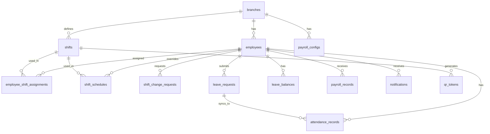

# DATABASE.md – Supabase Schema

> All tables have `branch_id` to support multi-branch in the future.
> UUID as primary key throughout. Timestamps use `timestamptz`.

---

## Design Context

The schema is designed around 4 core business processes:

1. **Attendance** — Each day, employees scan QR to record check-in/out into `attendance_records`. The system auto-calculates status based on `shifts`.
2. **Leave** — Employees create `leave_requests`, admin approves. Upon approval, auto-creates corresponding `attendance_records` and deducts `leave_balances`.
3. **Shift Change** — Employees create `shift_change_requests`. Upon approval, records are written to `shift_schedules` (override for that day). The system prioritizes `shift_schedules` over `employee_shift_assignments`.
4. **Payroll** — At month end, Edge Function reads `attendance_records` + `payroll_configs` + `employees` to calculate and save to `payroll_records`.

---

## Business Process Data Flows

### When employee checks in via QR
```
qr_tokens (validate token + shift)
shifts (get start_time, grace_period)
shift_schedules → employee_shift_assignments (determine today's shift for employee)
  ↓ write result to
attendance_records (insert check_in_at, status, late_minutes)
notifications (insert confirmation for employee)
```

### When admin approves leave request
```
leave_requests (update status → approved)
leave_balances (update used_paid_days += total_days)
attendance_records (upsert status = 'leave' for each day in range)
notifications (insert notification for employee)
```

### When admin approves shift change
```
shift_change_requests (update status → approved)
shift_schedules (upsert new shift_id for target_date)
qr_tokens (deactivate old token, generate new token if in the future)
notifications (insert notification for employee)
```

### When calculating monthly payroll
```
attendance_records (read all records for the month)
employees (read base_salary, allowance)
payroll_configs (read ot_multiplier, late_penalty, bonus conditions)
  ↓ calculate in Edge Function
payroll_records (upsert draft record with full breakdown)
```

---

## ERD Overview



---

## Table Details

### `branches`
Company branches. All other data is tied to a branch.

| Column | Type | Notes |
|---|---|---|
| id | uuid PK | |
| name | text NOT NULL | Branch name |
| address | text | Address |
| created_at | timestamptz | default now() |

---

### `users`
Login accounts. **Custom auth — not using Supabase Auth.**

| Column | Type | Notes |
|---|---|---|
| id | uuid PK | Auto-generated, not linked to auth.users |
| phone | text UNIQUE NOT NULL | Phone number used for login |
| password_hash | text NOT NULL | SHA-256 of password (hex string) |
| role | enum NOT NULL | `super_admin`, `manager`, `employee` |
| branch_id | uuid | FK → branches.id |
| created_at | timestamptz | default now() |

> **RLS:** Permissive for anon key — authorization handled at the app layer.
> Default password when creating employee = phone number. Employee changes password on first login.

---

### `employees`
Employee profiles. Each employee is linked to 1 `user` account.

| Column | Type | Notes |
|---|---|---|
| id | uuid PK | |
| user_id | uuid | FK → users.id, UNIQUE |
| branch_id | uuid NOT NULL | FK → branches.id |
| employee_code | text UNIQUE | Employee code (e.g., NV001) |
| full_name | text NOT NULL | |
| phone | text NOT NULL | |
| email | text | Optional |
| type | enum NOT NULL | `fulltime`, `parttime` |
| department | text | Department |
| position | text | Position |
| base_salary | numeric NOT NULL | Base salary (VND/month) |
| allowance | numeric default 0 | Fixed allowance (VND/month) |
| join_date | date | Join date |
| status | enum | `active`, `inactive`, `probation` |
| avatar_url | text | |
| created_at | timestamptz | |
| updated_at | timestamptz | |

---

### `shifts`
Defines company work shifts.

| Column | Type | Notes |
|---|---|---|
| id | uuid PK | |
| branch_id | uuid NOT NULL | FK → branches.id |
| name | text NOT NULL | e.g., "Shift 1 – Morning" |
| start_time | time NOT NULL | e.g., 07:00 |
| end_time | time NOT NULL | e.g., 12:00 |
| grace_period_minutes | int default 0 | Allowed late minutes (no penalty) |
| early_leave_minutes | int default 0 | How many minutes early before counted as early leave |
| is_overnight | bool default false | Overnight shift (end_time < start_time) |
| created_at | timestamptz | |

---

### `employee_shift_assignments`
Assigns default shift to employees by month.

| Column | Type | Notes |
|---|---|---|
| id | uuid PK | |
| employee_id | uuid NOT NULL | FK → employees.id |
| shift_id | uuid NOT NULL | FK → shifts.id |
| month | int NOT NULL | 1–12 |
| year | int NOT NULL | e.g., 2026 |
| created_at | timestamptz | |
| | UNIQUE | (employee_id, month, year) |

---

### `shift_schedules`
Shift schedule override for specific dates. Used when admin schedules or approves shift changes.

| Column | Type | Notes |
|---|---|---|
| id | uuid PK | |
| employee_id | uuid NOT NULL | FK → employees.id |
| shift_id | uuid | FK → shifts.id. NULL = unpaid day off |
| date | date NOT NULL | Specific date |
| is_override | bool default true | Distinguishes admin-created schedules from generated ones |
| created_by | uuid | FK → users.id |
| created_at | timestamptz | |
| | UNIQUE | (employee_id, date) |

---

### `shift_change_requests`
Shift change requests from employees.

| Column | Type | Notes |
|---|---|---|
| id | uuid PK | |
| employee_id | uuid NOT NULL | FK → employees.id |
| requested_shift_id | uuid NOT NULL | Requested shift |
| request_type | enum | `single_day`, `week` |
| target_date | date | If type = single_day |
| week_start_date | date | If type = week (start of week) |
| reason | text | |
| status | enum default 'pending' | `pending`, `approved`, `rejected` |
| reviewed_by | uuid | FK → users.id |
| reviewed_at | timestamptz | |
| rejection_reason | text | |
| created_at | timestamptz | |

---

### `qr_tokens`
Dynamic QR tokens, auto-generated 30 minutes before each shift via pg_cron.

| Column | Type | Notes |
|---|---|---|
| id | uuid PK | |
| shift_id | uuid NOT NULL | FK → shifts.id |
| branch_id | uuid NOT NULL | FK → branches.id |
| date | date NOT NULL | Shift date |
| token | text UNIQUE NOT NULL | UUID or signed JWT |
| expires_at | timestamptz NOT NULL | = shift's end_time for that date |
| is_active | bool default true | Admin can deactivate |
| created_at | timestamptz | |
| | UNIQUE | (shift_id, date) |

---

### `attendance_records`
Attendance records. Each row = 1 employee × 1 day × 1 shift.

| Column | Type | Notes |
|---|---|---|
| id | uuid PK | |
| employee_id | uuid NOT NULL | FK → employees.id |
| shift_id | uuid NOT NULL | FK → shifts.id |
| date | date NOT NULL | |
| check_in_at | timestamptz | Check-in time |
| check_out_at | timestamptz | Check-out time |
| check_in_source | enum | `qr`, `link`, `manual` |
| check_out_source | enum | `qr`, `link`, `manual` |
| status | enum | `present`, `late`, `absent`, `leave`, `holiday` |
| late_minutes | int default 0 | Late minutes (0 if on time) |
| early_leave_minutes | int default 0 | Early leave minutes |
| overtime_minutes | int default 0 | OT minutes after shift |
| is_holiday | bool default false | Holiday → different OT multiplier |
| notes | text | Admin notes when entering manually |
| created_by | uuid | FK → users.id. NULL if self check-in |
| leave_request_id | uuid | FK → leave_requests.id if status = leave |
| created_at | timestamptz | |
| updated_at | timestamptz | |
| | UNIQUE | (employee_id, date, shift_id) |

---

### `leave_policies`
Leave policies, configured by employee type and branch.

| Column | Type | Notes |
|---|---|---|
| id | uuid PK | |
| branch_id | uuid NOT NULL | FK → branches.id |
| employee_type | enum | `fulltime`, `parttime` |
| paid_days_per_year | int NOT NULL | Paid leave days per year |
| carry_over_enabled | bool default false | Allow carry-over to next year |
| max_carry_over_days | int | Maximum carry-over days |
| min_advance_notice_days | int default 1 | Must request at least N working days in advance |
| created_at | timestamptz | |
| | UNIQUE | (branch_id, employee_type) |

---

### `leave_balances`
Remaining leave days for each employee by year.

| Column | Type | Notes |
|---|---|---|
| id | uuid PK | |
| employee_id | uuid NOT NULL | FK → employees.id |
| year | int NOT NULL | |
| total_paid_days | numeric NOT NULL | Total leave days allocated (policy + carry_over) |
| used_paid_days | numeric default 0 | Used days |
| carried_over_days | numeric default 0 | Carried over from previous year |
| updated_at | timestamptz | |
| | UNIQUE | (employee_id, year) |

---

### `leave_requests`
Leave requests from employees.

| Column | Type | Notes |
|---|---|---|
| id | uuid PK | |
| employee_id | uuid NOT NULL | FK → employees.id |
| leave_type | enum | `paid`, `unpaid`, `sick`, `maternity`, `other` |
| start_date | date NOT NULL | |
| end_date | date NOT NULL | |
| total_days | numeric NOT NULL | Auto-calculated (excluding weekends/holidays if needed) |
| reason | text | |
| status | enum default 'pending' | `pending`, `approved`, `rejected` |
| reviewed_by | uuid | FK → users.id |
| reviewed_at | timestamptz | |
| rejection_reason | text | |
| created_at | timestamptz | |

---

### `payroll_configs`
Payroll calculation configuration. Admin edits. Has history (effective_from).

| Column | Type | Notes |
|---|---|---|
| id | uuid PK | |
| branch_id | uuid NOT NULL | FK → branches.id |
| ot_multiplier_weekday | numeric default 1.5 | Weekday OT multiplier |
| ot_multiplier_weekend | numeric default 2.0 | Weekend OT multiplier |
| ot_multiplier_holiday | numeric default 3.0 | Holiday OT multiplier |
| late_penalty_per_minute | numeric default 0 | Penalty per late minute (VND) |
| absent_penalty_per_day | numeric default 0 | Penalty per unpaid absence day (VND) |
| attendance_bonus | numeric default 0 | Monthly attendance bonus (VND) |
| attendance_bonus_condition | jsonb | e.g., `{"max_late_times": 0, "min_attendance_rate": 1.0}` |
| bhxh_employee_rate | numeric default 0.08 | Employee BHXH contribution rate |
| bhxh_employer_rate | numeric default 0.175 | Employer BHXH contribution rate (for display) |
| effective_from | date NOT NULL | Config effective from this date |
| created_at | timestamptz | |

---

### `payroll_records`
Monthly payroll records for each employee. Calculated by Edge Function.

| Column | Type | Notes |
|---|---|---|
| id | uuid PK | |
| employee_id | uuid NOT NULL | FK → employees.id |
| month | int NOT NULL | 1–12 |
| year | int NOT NULL | |
| working_days_standard | int | Standard work days for the month |
| working_days_actual | numeric | Actual work days (calculated by shift) |
| base_salary | numeric | Monthly base salary |
| salary_earned | numeric | Salary based on actual work days |
| allowance | numeric | Monthly allowance |
| overtime_pay | numeric | OT pay |
| attendance_bonus | numeric | Attendance bonus |
| late_penalty | numeric | Total late penalty |
| absent_penalty | numeric | Total unpaid absence penalty |
| gross_salary | numeric | Gross salary before deductions |
| bhxh_employee | numeric | Employee BHXH contribution (calculated from config) |
| tax | numeric default 0 | Personal income tax (admin enters manually) |
| net_salary | numeric | Net salary = gross - bhxh - tax |
| adjustment_notes | text | Notes if admin adjusted manually |
| status | enum default 'draft' | `draft`, `confirmed` |
| confirmed_by | uuid | FK → users.id |
| confirmed_at | timestamptz | |
| created_at | timestamptz | |
| | UNIQUE | (employee_id, month, year) |

---

### `notifications`
Realtime notifications for users (admin and employees).

| Column | Type | Notes |
|---|---|---|
| id | uuid PK | |
| user_id | uuid NOT NULL | FK → users.id (recipient) |
| type | enum | `leave_request_new`, `leave_approved`, `leave_rejected`, `shift_change_new`, `shift_change_approved`, `shift_change_rejected`, `payroll_confirmed`, `attendance_manual` |
| title | text NOT NULL | Short title |
| body | text | Detailed content |
| reference_id | uuid | ID of related record (leave_request, shift_change_request...) |
| reference_type | text | Table name (for navigating to the right page) |
| is_read | bool default false | |
| created_at | timestamptz | |

---

### `audit_logs`
History of important admin operations.

| Column | Type | Notes |
|---|---|---|
| id | uuid PK | |
| user_id | uuid NOT NULL | FK → users.id (actor) |
| action | text NOT NULL | e.g., `manual_checkin`, `edit_payroll`, `approve_leave` |
| table_name | text | Affected table |
| record_id | uuid | Affected record ID |
| old_values | jsonb | Values before change |
| new_values | jsonb | Values after change |
| created_at | timestamptz | |

---

## RLS Policy

Custom auth does not use Supabase Auth, so there is no `auth.uid()`. RLS is currently permissive for anon key — authorization is checked entirely at the application layer (route guard, query filter by `branch_id`).

| Table | Current | Notes |
|---|---|---|
| All | `allow_all` for anon | Internal app, not on public internet |
